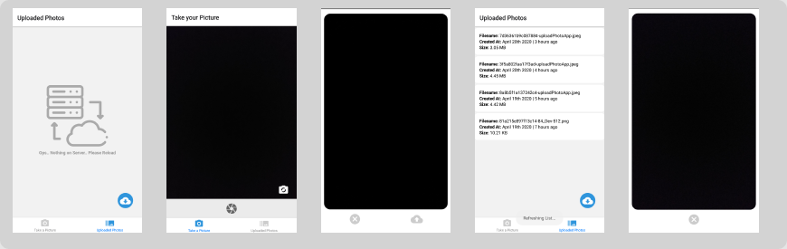

# Photo App

Application developed with React Native, to capture and upload images for server.



## Installation

Use the package manager [yarn](https://yarnpkg.com/) or [npm](https://www.npmjs.com/) to install.

```bash
yarn install
```

If necessary, you can install [expo-cli](https://docs.expo.io/versions/latest/workflow/expo-cli/) to run this app on emulator.

```bash
npm install -g expo-cli
```

## Usage

In root path, after install all dependencies, start local server:

```bash
yarn start
```
